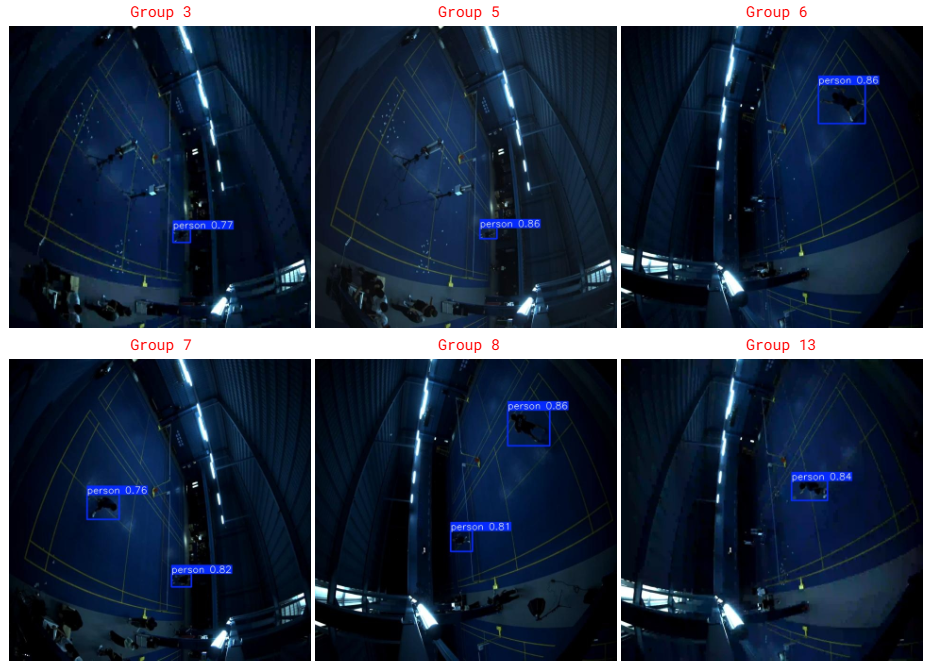
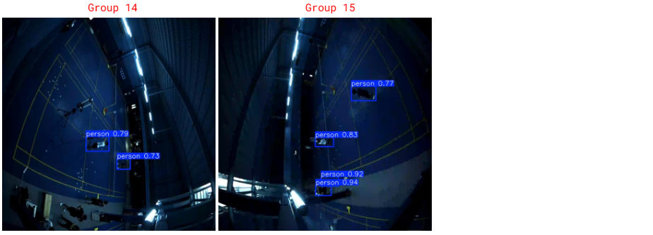
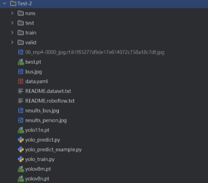
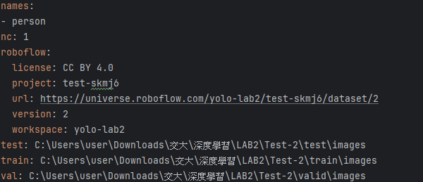
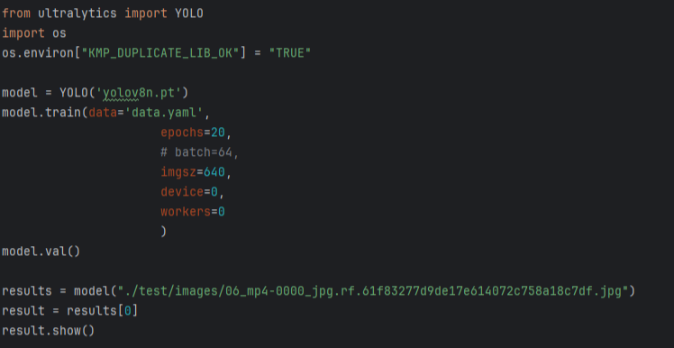
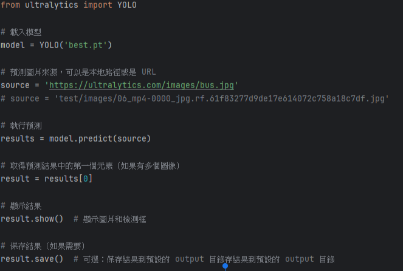

# YOLOv8-badminton-person

<h2> Labeling Data </h2>

1. https://app.roboflow.com/yolo-lab2 透過roboflow標記資料
2. 新增person class
3. 可參考影片 roboflow labeling tool tutorial.mkv

<h2>原始dataset</h2> 
1. 這邊是原始影片透過Roboflow將每秒切成60frame後，進行person標記

<h2>Train_Group6</h2> 
1. 只Train Group6這組的資料

<h2>Train_Group6_Augmentation</h2> 
1. 只Train Group6這組的資料，但有加上Augmentation (水平翻轉、垂直翻轉)

<h2>Train_8Group_Dataset</h2> 
1. Train 8組的資料

<h2>Download Data</h2> 

<h3>執行完後會自動產生資料夾</h3>

<h3>Adjust Yaml</h3>
類別person  
nc 一種類別  
test, train, val → 指定資料夾  

<h2>Training Data</h2> 
通常在 runs/detect/train42/weights/best.pt  → 這是模型

1. Class: 顯示了類別的名稱。在您的情況下，只有一個類別（all）。  
2. Images: 驗證集中的圖片數量（67張圖片）。  
3. Instances: 類別出現的總次數（67次）。  
4. Box(P): 預測框的精度（Precision），值為 1，意味著模型預測的框與真實框完全匹配。  
5. R: 召回率（Recall），值為 0.951，這表示模型在所有實際物體中，有 95.1% 被正確識別。  
6. mAP50: 在 IoU (Intersection over Union) 50% 的閾值下的平均精度（mean Average Precision at 50% IoU），值為 0.995，顯示在 50% 的 IoU 閾值下模型的精度很高。  
7. mAP50-95: 在不同的 IoU 閾值下（從 50% 到 95%）計算的平均精度，值為 0.84，這是更加綜合的衡量指標。  

<h2>Predict Data</h2> 
結果通常在 runs/detect/predict 下

